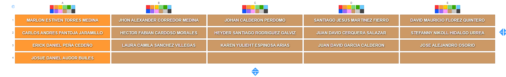

## 1. Producto
   - **Descripción:** Representa un artículo que se vende o comercializa.
   - **Atributos:** Nombre, precio, cantidad en stock, categoría, descripción.

## 2. Cliente
   - **Descripción:** Persona que realiza compras o utiliza los servicios de una empresa.
   - **Atributos:** Nombre, apellido, dirección, correo electrónico, teléfono.

## 3. Empleado
   - **Descripción:** Individuo contratado por una empresa para realizar tareas específicas.
   - **Atributos:** Nombre, apellido, cargo, salario, fecha de contratación.

## 4. Proveedor
   - **Descripción:** Entidad que suministra productos o servicios a una empresa.
   - **Atributos:** Nombre de la empresa, dirección, persona de contacto, correo electrónico, teléfono.

## 5. Pedido
   - **Descripción:** Solicitud de productos o servicios realizada por un cliente.
   - **Atributos:** Número de pedido, fecha de pedido, cliente, productos, estado del pedido.

## 6. Factura
   - **Descripción:** Documento que detalla los productos o servicios adquiridos y el costo total.
   - **Atributos:** Número de factura, fecha de emisión, cliente, productos, total a pagar.

## 7. Vehículo
   - **Descripción:** Medio de transporte que se utiliza para desplazarse.
   - **Atributos:** Marca, modelo, año, tipo de combustible, número de placa, color.

## 8. Mascota
   - **Descripción:** Animal domesticado que vive con una persona o familia.
   - **Atributos:** Nombre, especie, raza, edad, propietario, fecha de última visita al veterinario.

## 9. Libro
   - **Descripción:** Obra literaria escrita por un autor y publicada para su distribución.
   - **Atributos:** Título, autor, género, año de publicación, número de páginas, editorial.

## 10. Canción
    - **Descripción:** Composición musical grabada o interpretada por un artista.
    - **Atributos:** Título, artista, álbum, género, duración, año de lanzamiento.

## 11. Evento
    - **Descripción:** Ocurrencia planificada o programada que reúne a personas para un propósito específico.
    - **Atributos:** Nombre, fecha, ubicación, organizador, tipo, invitados.

## 12. Proyecto
    - **Descripción:** Actividad planificada que tiene un objetivo específico y un plazo definido.
    - **Atributos:** Nombre, descripción, fecha de inicio, fecha de finalización, responsable, estado.

## 13. Receta
    - **Descripción:** Instrucciones detalladas para preparar un plato o bebida.
    - **Atributos:** Nombre, ingredientes, pasos de preparación, dificultad, tiempo de cocción.

## 14. Universidad
    - **Descripción:** Institución de educación superior que otorga títulos académicos.
    - **Atributos:** Nombre, ubicación, carreras ofrecidas, número de estudiantes, rector, año de fundación.

## 15. Película
    - **Descripción:** Obra audiovisual que narra una historia a través de imágenes en movimiento.
    - **Atributos:** Título, director, género, año de estreno, actores principales, duración.

## 16. Restaurante
    - **Descripción:** Establecimiento donde se preparan y sirven alimentos y bebidas para ser consumidos en el lugar.
    - **Atributos:** Nombre, dirección, tipo de cocina, horario de atención, capacidad, menú.

# Asignación
* Ver la lista de aprendices y desarrollar según corresponda, para leer la asignación debe ser de izquierda a derecha, fila a fila. 

# Actividad a realizar.
- Crear backend 
- Crear frontend
- Usar métodos All, FindById, Save, Update, Delete